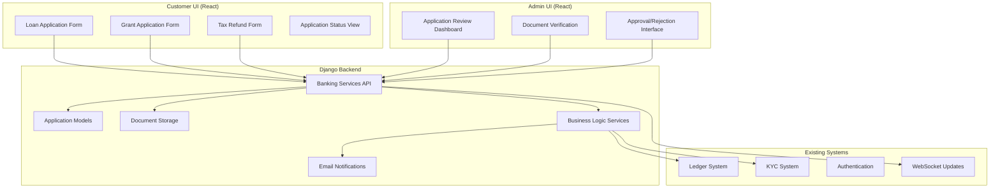
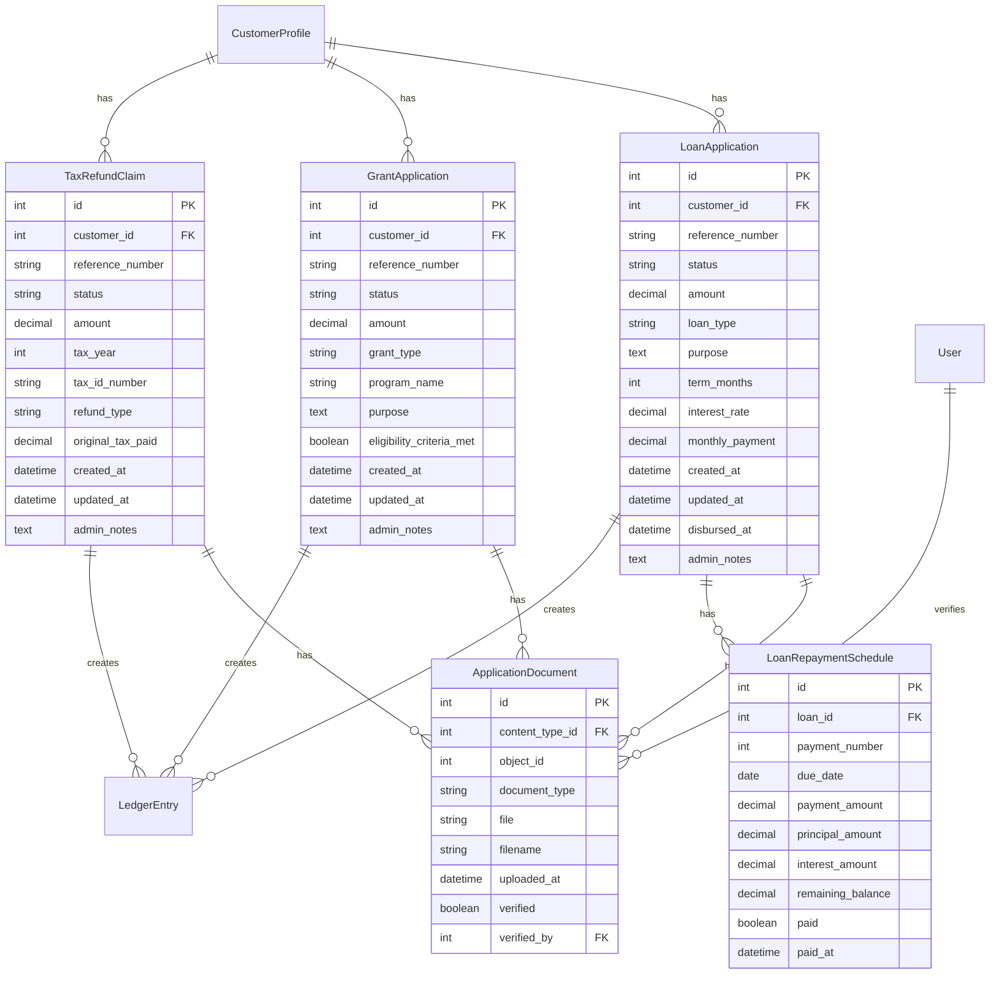
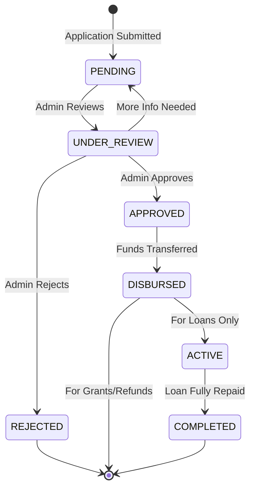

# Design Document: Banking Services

## Overview

This design document outlines the implementation of three core banking services for the SnelROI platform: Loans, Grants, and Tax Refunds. The design integrates seamlessly with the existing Django-based backend, React frontends, and ledger-based accounting system while maintaining the platform's architectural patterns and MVP simplicity.

The banking services will extend the current transaction approval workflow model, where applications follow a similar pattern to deposits/withdrawals: customers submit applications through the Customer UI, admins review and approve through the Admin UI, and approved services result in ledger postings for fund disbursement.

## Architecture

### High-Level Architecture

The banking services follow the existing SnelROI architectural patterns:



### Integration Points

1. **Ledger System Integration**: All approved services create appropriate ledger postings using existing `LedgerEntry` and `LedgerPosting` models
2. **KYC System Integration**: Application eligibility checks leverage existing customer tier validation
3. **Authentication**: Uses existing JWT authentication system
4. **Email System**: Leverages existing Django email backend and template system
5. **WebSocket Updates**: Integrates with existing Django Channels infrastructure for real-time updates

## Components and Interfaces

### Backend Components

#### Models

**BaseApplication (Abstract Model)**
```python
class BaseApplication(models.Model):
    customer = models.ForeignKey(CustomerProfile, on_delete=models.CASCADE)
    reference_number = models.CharField(max_length=20, unique=True)
    status = models.CharField(max_length=20, choices=APPLICATION_STATUS_CHOICES)
    amount = models.DecimalField(max_digits=12, decimal_places=2)
    created_at = models.DateTimeField(auto_now_add=True)
    updated_at = models.DateTimeField(auto_now=True)
    admin_notes = models.TextField(blank=True)
    
    class Meta:
        abstract = True
```

**LoanApplication**
```python
class LoanApplication(BaseApplication):
    LOAN_TYPE_CHOICES = [
        ('PERSONAL', 'Personal Loan'),
        ('BUSINESS', 'Business Loan'),
    ]
    
    loan_type = models.CharField(max_length=20, choices=LOAN_TYPE_CHOICES)
    purpose = models.TextField()
    term_months = models.IntegerField()  # Loan term in months
    interest_rate = models.DecimalField(max_digits=5, decimal_places=2, null=True, blank=True)
    monthly_payment = models.DecimalField(max_digits=10, decimal_places=2, null=True, blank=True)
    disbursed_at = models.DateTimeField(null=True, blank=True)
```

**GrantApplication**
```python
class GrantApplication(BaseApplication):
    GRANT_TYPE_CHOICES = [
        ('GOVERNMENT', 'Government Grant'),
        ('INSTITUTIONAL', 'Institutional Grant'),
    ]
    
    grant_type = models.CharField(max_length=20, choices=GRANT_TYPE_CHOICES)
    program_name = models.CharField(max_length=200)
    purpose = models.TextField()
    eligibility_criteria_met = models.BooleanField(default=False)
```

**TaxRefundClaim**
```python
class TaxRefundClaim(BaseApplication):
    tax_year = models.IntegerField()
    tax_id_number = models.CharField(max_length=50)
    refund_type = models.CharField(max_length=50)  # Federal, State, etc.
    original_tax_paid = models.DecimalField(max_digits=12, decimal_places=2)
```

**ApplicationDocument**
```python
class ApplicationDocument(models.Model):
    content_type = models.ForeignKey(ContentType, on_delete=models.CASCADE)
    object_id = models.PositiveIntegerField()
    application = GenericForeignKey('content_type', 'object_id')
    
    document_type = models.CharField(max_length=50)  # 'income_proof', 'tax_return', etc.
    file = models.FileField(upload_to='application_documents/')
    filename = models.CharField(max_length=255)
    uploaded_at = models.DateTimeField(auto_now_add=True)
    verified = models.BooleanField(default=False)
    verified_by = models.ForeignKey(User, on_delete=models.SET_NULL, null=True, blank=True)
```

**LoanRepaymentSchedule**
```python
class LoanRepaymentSchedule(models.Model):
    loan = models.ForeignKey(LoanApplication, on_delete=models.CASCADE, related_name='repayment_schedule')
    payment_number = models.IntegerField()
    due_date = models.DateField()
    payment_amount = models.DecimalField(max_digits=10, decimal_places=2)
    principal_amount = models.DecimalField(max_digits=10, decimal_places=2)
    interest_amount = models.DecimalField(max_digits=10, decimal_places=2)
    remaining_balance = models.DecimalField(max_digits=12, decimal_places=2)
    paid = models.BooleanField(default=False)
    paid_at = models.DateTimeField(null=True, blank=True)
```

#### API Endpoints

**Loan Endpoints**
- `POST /api/loans/applications/` - Submit loan application
- `GET /api/loans/applications/` - List customer's loan applications
- `GET /api/loans/applications/{id}/` - Get specific loan application
- `POST /api/loans/applications/{id}/documents/` - Upload loan documents
- `GET /api/loans/active/` - Get customer's active loans
- `POST /api/loans/{id}/payments/` - Make loan payment

**Grant Endpoints**
- `POST /api/grants/applications/` - Submit grant application
- `GET /api/grants/applications/` - List customer's grant applications
- `GET /api/grants/applications/{id}/` - Get specific grant application
- `POST /api/grants/applications/{id}/documents/` - Upload grant documents

**Tax Refund Endpoints**
- `POST /api/tax-refunds/claims/` - Submit tax refund claim
- `GET /api/tax-refunds/claims/` - List customer's tax refund claims
- `GET /api/tax-refunds/claims/{id}/` - Get specific tax refund claim
- `POST /api/tax-refunds/claims/{id}/documents/` - Upload tax documents

**Admin Endpoints**
- `GET /api/admin/applications/` - List all applications (with filtering)
- `PUT /api/admin/applications/{id}/approve/` - Approve application
- `PUT /api/admin/applications/{id}/reject/` - Reject application
- `PUT /api/admin/documents/{id}/verify/` - Verify document

#### Services Layer

**LoanService**
```python
class LoanService:
    @staticmethod
    def calculate_monthly_payment(principal, annual_rate, term_months):
        """Calculate monthly payment using standard amortization formula"""
        monthly_rate = annual_rate / 12 / 100
        if monthly_rate == 0:
            return principal / term_months
        return principal * (monthly_rate * (1 + monthly_rate) ** term_months) / \
               ((1 + monthly_rate) ** term_months - 1)
    
    @staticmethod
    def generate_repayment_schedule(loan_application):
        """Generate complete repayment schedule for approved loan"""
        # Implementation details for amortization schedule generation
        
    @staticmethod
    def process_loan_payment(loan_id, payment_amount):
        """Process loan payment and update ledger"""
        # Create ledger postings for loan payment
```

**ApplicationService**
```python
class ApplicationService:
    @staticmethod
    def approve_application(application, admin_user):
        """Approve application and trigger disbursement"""
        # Update status, create ledger postings, send notifications
        
    @staticmethod
    def reject_application(application, admin_user, reason):
        """Reject application with reason"""
        # Update status, send rejection notification
        
    @staticmethod
    def disburse_funds(application):
        """Create ledger postings for fund disbursement"""
        # Integration with existing ledger system
```

### Frontend Components

#### Customer UI Components

**Application Forms**
- `LoanApplicationForm.tsx` - Loan application with document upload
- `GrantApplicationForm.tsx` - Grant application with program selection
- `TaxRefundForm.tsx` - Tax refund claim with tax document upload
- `DocumentUpload.tsx` - Reusable document upload component
- `ApplicationStatus.tsx` - Real-time status display component

**Dashboard Components**
- `BankingServicesDashboard.tsx` - Overview of all applications
- `ActiveLoans.tsx` - Display active loans with payment options
- `ApplicationHistory.tsx` - Historical view of all applications

#### Admin UI Components

**Review Components**
- `ApplicationReviewDashboard.tsx` - List and filter applications
- `ApplicationDetailView.tsx` - Detailed application review interface
- `DocumentVerificationPanel.tsx` - Document review and verification
- `ApprovalInterface.tsx` - Approve/reject with notes

**Management Components**
- `LoanManagement.tsx` - Loan-specific management features
- `GrantManagement.tsx` - Grant program management
- `TaxRefundManagement.tsx` - Tax refund processing interface

## Data Models

### Database Schema



### Status Flow



## Correctness Properties

*A property is a characteristic or behavior that should hold true across all valid executions of a system—essentially, a formal statement about what the system should do. Properties serve as the bridge between human-readable specifications and machine-verifiable correctness guarantees.*

Based on the prework analysis, here are the key correctness properties for the banking services:

**Property 1: Application Creation Consistency**
*For any* valid application submission (loan, grant, or tax refund), the system should create an application record with PENDING status and assign a unique reference number
**Validates: Requirements 1.2, 4.2, 7.2, 4.4, 7.4**

**Property 2: Document Upload and Storage**
*For any* document uploaded for banking services, the system should store the document with proper validation and make it accessible for admin review
**Validates: Requirements 1.3, 4.3, 10.1, 10.3**

**Property 3: Ledger Integration for All Transactions**
*For any* approved banking service (loan disbursement, grant disbursement, tax refund, loan payment), the system should create appropriate double-entry ledger postings
**Validates: Requirements 3.1, 3.5, 6.1, 9.1, 12.1**

**Property 4: Status Change Notifications**
*For any* application status change (approval, rejection, disbursement), the system should send email notification to the customer
**Validates: Requirements 1.4, 2.4, 4.4, 6.4, 7.4, 9.4, 11.1, 11.2**

**Property 5: Disbursement Status Updates**
*For any* successful fund disbursement, the system should update the application status appropriately (ACTIVE for loans, DISBURSED for grants, COMPLETED for tax refunds)
**Validates: Requirements 3.2, 6.2, 9.2**

**Property 6: Repayment Schedule Generation**
*For any* approved loan, the system should generate a complete repayment schedule with proper interest calculations
**Validates: Requirements 2.3**

**Property 7: Loan Payment Processing**
*For any* loan payment, the system should reduce the outstanding balance and create corresponding ledger entries
**Validates: Requirements 3.4, 3.5**

**Property 8: Document Verification Workflow**
*For any* uploaded document, admins should be able to mark it as verified or flag it for additional review
**Validates: Requirements 5.3, 8.3**

**Property 9: Application Review Information Display**
*For any* application under admin review, all required customer information and uploaded documents should be displayed
**Validates: Requirements 2.2, 5.2, 8.2**

**Property 10: KYC Integration**
*For any* eligibility check, the system should validate against existing KYC tier requirements
**Validates: Requirements 12.2**

<function_calls>
<invoke name="prework">
<parameter name="featureName">banking-services

## Error Handling

### Application Validation Errors
- **Invalid KYC Tier**: Return clear error message when customer doesn't meet minimum tier requirements
- **Incomplete Application**: Validate all required fields and return specific field-level errors
- **Duplicate Applications**: Prevent duplicate active applications for the same customer and service type

### Document Upload Errors
- **File Size Limits**: Enforce maximum file size (e.g., 10MB) with clear error messages
- **File Type Validation**: Only allow specific file types (PDF, JPG, PNG) for document uploads
- **Upload Failures**: Provide retry mechanism and clear error messages for failed uploads

### Processing Errors
- **Ledger Integration Failures**: Implement rollback mechanism if ledger posting fails during disbursement
- **Email Delivery Failures**: Log failed email attempts and implement retry mechanism
- **Calculation Errors**: Validate loan calculations and handle edge cases (zero interest, very short terms)

### System Integration Errors
- **Authentication Failures**: Handle JWT token expiration gracefully with proper error responses
- **Database Constraints**: Handle unique constraint violations and foreign key errors appropriately
- **External Service Failures**: Implement graceful degradation if external services are unavailable

## Testing Strategy

### Dual Testing Approach

The banking services will use both unit testing and property-based testing for comprehensive coverage:

**Unit Tests**: Focus on specific examples, edge cases, and integration points
- Test specific loan calculation scenarios (zero interest, edge amounts)
- Test document upload edge cases (empty files, invalid formats)
- Test email template rendering with various data combinations
- Test API endpoint responses for specific scenarios
- Test admin approval/rejection workflows with specific data

**Property-Based Tests**: Verify universal properties across all inputs using Hypothesis (Python's property-based testing library)
- Generate random application data to test property compliance
- Test with various customer profiles and KYC tiers
- Generate random document uploads to test storage consistency
- Test ledger integration with various transaction amounts
- Minimum 100 iterations per property test to ensure thorough coverage

### Property Test Configuration

Each property-based test will:
- Run minimum 100 iterations with randomized inputs
- Reference the corresponding design document property
- Use tags in the format: **Feature: banking-services, Property {number}: {property_text}**
- Test edge cases through generator configuration (zero amounts, boundary values)

### Test Coverage Requirements

- **Backend Services**: 90%+ code coverage for business logic in services layer
- **API Endpoints**: Complete coverage of all success and error scenarios
- **Model Validation**: Test all model constraints and validation rules
- **Integration Points**: Test all interactions with existing ledger and KYC systems

### Testing Tools and Framework

- **Django Test Framework**: For unit tests and API endpoint testing
- **Hypothesis**: For property-based testing with random data generation
- **Factory Boy**: For creating test data fixtures
- **Mock/Patch**: For isolating external dependencies during testing
- **Django Test Client**: For API endpoint integration testing

The combination of unit tests and property-based tests ensures both concrete bug detection and general correctness validation across the wide range of possible inputs and scenarios in the banking services system.